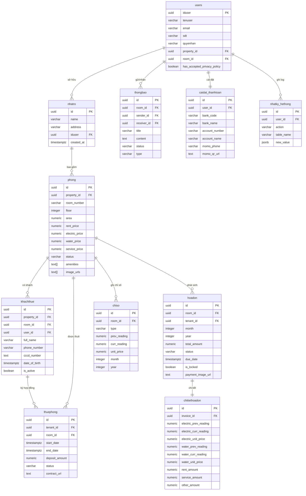

# BÁO CÁO PHẦN 1
# NGHIÊN CỨU & THIẾT KẾ HỆ THỐNG QUẢN LÝ NHÀ TRỌ

> **Tên dự án:** Ứng dụng Quản lý Nhà trọ — *Minh bạch · Tiện lợi · Đúng luật*
> **Nền tảng:** Web, App Android, Desktop
> **Công nghệ chính:** Flutter · Supabase (PostgreSQL) · Clean Architecture · BLoC

> **TÓM TẮT PHẦN 1:**
> Phần 1 của báo cáo tập trung vào việc nghiên cứu, phân tích yêu cầu và thiết kế tổng thể cho hệ thống Quản lý Nhà trọ. Xuất phát từ thực trạng quản lý thủ công nhiều bất cập, dự án đề xuất giải pháp ứng dụng đa nền tảng (Flutter) kết hợp nền tảng đám mây (Supabase) nhằm số hóa quy trình quản lý cho chủ trọ và cung cấp tiện ích cho khách thuê. Nội dung phần này bao gồm: định hình yêu cầu chức năng/phi chức năng, lựa chọn công nghệ, thiết kế kiến trúc (Clean Architecture), mô hình cơ sở dữ liệu (ERD), phác thảo UI/UX và hoàn thiện các module quản lý cốt lõi.

---

## 1. KHẢO SÁT & PHÂN TÍCH YÊU CẦU

### 1.1 Khảo sát thực tế bài toán quản lý nhà trọ

Thị trường cho thuê phòng trọ tại các khu vực tập trung đông sinh viên và người lao động luôn có nhu cầu ổn định. Tuy nhiên, qua khảo sát thực tế tại một số khu vực lân cận, phần lớn các chủ nhà trọ có quy mô nhỏ và vừa (từ 5–50 phòng) vẫn đang duy trì phương pháp quản lý thủ công, bao gồm:

| Vấn đề hiện tại | Hậu quả |
|-----------------|---------|
| Ghi chép chỉ số điện/nước bằng tay (sổ, giấy) | Dễ sai sót, tranh chấp với khách |
| Tính tiền phòng thủ công bằng Excel/máy tính | Mất thời gian, khó theo dõi lịch sử |
| Không có hệ thống theo dõi hợp đồng | Bỏ sót ngày hết hạn, vi phạm pháp lý |
| Thông báo/nhắc nhở qua tin nhắn Zalo, Facebook | Không chuyên nghiệp, dễ bỏ sót |
| Lưu trữ thông tin CCCD khách thuê dạng giấy | Rủi ro mất mát, không tra cứu được |
| Không có báo cáo thu chi tổng hợp | Không kiểm soát được tài chính |

**Kết luận khảo sát:** Cần một hệ thống ứng dụng đa nền tảng tập trung, dễ dùng, hỗ trợ đa vai trò (chủ trọ — khách thuê), hoạt động được offline và đồng bộ dữ liệu theo thời gian thực.

**Mục tiêu dự án & Phạm vi tiếp cận:**
- **Mục tiêu:** Giải quyết bài toán quản lý cư dân tạm trú minh bạch, hỗ trợ trích xuất dữ liệu dễ dàng để khai báo với cơ quan chức năng và phục vụ kê khai thuế cho hộ kinh doanh theo đúng quy định pháp luật.
- **Phạm vi:** Hướng tới khu vực có mật độ dân cư cao (khu công nghiệp, khu lao động). Bán kính hoạt động hiệu quả trong vòng 10km giúp khách thuê tiếp cận mạng lưới cho thuê phòng nhanh chóng, đồng thời phổ cập công nghệ chuyển đổi số cho người lao động.

---

### 1.2 Phân tích đối tượng người dùng

#### 👤 Chủ trọ (Owner / Admin)
- **Đặc điểm:** Trung niên (35–55 tuổi), không rành công nghệ cao
- **Nhu cầu chính:**
  - Quản lý danh sách phòng và trạng thái (trống / đang thuê / bảo trì)
  - Nhập chỉ số điện nước hàng tháng, tạo hóa đơn tự động
  - Xem báo cáo thu chi, thống kê phòng
  - Thông báo nhắc thanh toán cho khách
  - Xuất hóa đơn PDF, in hóa đơn nhiệt (Bluetooth)
- **Kỳ vọng UX:** Giao diện đơn giản, thao tác nhanh, ít bước

#### 👤 Khách thuê (Tenant)
- **Đặc điểm:** Trẻ tuổi (18–30 tuổi), quen dùng smartphone
- **Nhu cầu chính:**
  - Xem hóa đơn tháng hiện tại (chi tiết từng khoản)
  - Xác nhận đã chuyển khoản (upload ảnh biên lai)
  - Xem lịch sử thanh toán
  - Nhận thông báo từ chủ trọ
- **Kỳ vọng UX:** Giao diện đẹp, thông tin rõ ràng, thanh toán tiện lợi qua QR

---

### 1.3 Danh sách yêu cầu chức năng & phi chức năng

#### 🔧 Yêu cầu chức năng (Functional Requirements)

**Module Xác thực (Auth)**
- [x] Đăng nhập bằng Email/SĐT + Mật khẩu
- [x] Đăng nhập bằng Google OAuth
- [x] Đăng ký tài khoản mới
- [x] Quên mật khẩu / Reset qua email
- [x] Đồng ý điều khoản sử dụng (Privacy Policy)
- [x] Phân quyền vai trò: Chủ trọ / Khách thuê

**Module Quản lý Phòng**
- [x] Xem danh sách phòng theo trạng thái (lưới/bộ lọc)
- [x] Thêm / Sửa / Xóa phòng
- [x] Gán khách thuê vào phòng
- [x] Trả phòng (checkout) — cập nhật hợp đồng
- [x] Xem chi tiết phòng (lịch sử, hợp đồng, hóa đơn)

**Module Quản lý Khách thuê**
- [x] Thêm / Sửa / Xóa thông tin khách
- [x] Lưu CCCD, ngày sinh, SĐT, email
- [x] Tìm kiếm khách nhanh (dialog)
- [x] Theo dõi trạng thái (đang ở / đã trả phòng)

**Module Hóa đơn**
- [x] Tạo hóa đơn tháng (tự động tính điện + nước + phòng + dịch vụ)
- [x] Xem chi tiết hóa đơn
- [x] Xác nhận thanh toán (chủ trọ / khách thuê)
- [x] Upload ảnh biên lai thanh toán
- [x] Xuất PDF, In hóa đơn nhiệt Bluetooth
- [x] Lịch sử hóa đơn theo phòng / theo tháng

**Module Điện nước (Utilities)**
- [x] Nhập chỉ số điện/nước đầu kỳ — cuối kỳ
- [x] Tự động tính tiêu thụ và thành tiền
- [x] Thiết lập đơn giá điện/nước theo phòng

**Module Thanh toán**
- [x] Cài đặt tài khoản ngân hàng (VietQR)
- [x] Tích hợp MoMo QR
- [x] Sinh mã QR chuyển khoản tự động
- [x] Template nội dung chuyển khoản (Phòng {room} tháng {month}/{year})

**Module Thông báo**
- [x] Push notification nhắc đóng tiền
- [x] Gửi thông báo từ chủ → khách
- [x] Phân loại thông báo: Thông báo chung / Sự cố / Hệ thống

**Module Dashboard**
- [x] Thống kê tổng quan: tổng phòng, phòng trống, phòng đang thuê
- [x] Biểu đồ thu nhập tháng
- [x] Danh sách hóa đơn sắp đến hạn / quá hạn

#### ⚙️ Yêu cầu phi chức năng (Non-functional Requirements)

| Tiêu chí | Yêu cầu |
|----------|---------|
| **Hiệu năng & Tối ưu** | Màn hình tải < 2 giây. Tự động nén ảnh (CCCD, biên lai) xuống dưới 500KB trước khi upload. Ứng dụng nhẹ, không gây hao pin, nóng máy. |
| **Bảo mật & Toàn vẹn** | Mã hóa AES-256 dữ liệu lưu trữ (CCCD, SĐT) và mã hóa truyền tải (HTTPS/TLS). Dùng Hashing chống sửa đổi hợp đồng/ảnh CCCD. Row Level Security (RLS) Supabase. |
| **Tính không thể chối bỏ** | Ghi Log (Nhật ký hệ thống) chi tiết mọi thao tác (ai sửa, ai xem CCCD, lúc nào) làm bằng chứng pháp lý. Phân quyền cực kỳ nghiêm ngặt. |
| **Độ tin cậy & Chịu tải** | Auto-scaling chịu tải cao điểm ngày 1-5 hàng tháng. Tự động chuyển cổng thanh toán dự phòng (mã QR tĩnh) nếu ngân hàng chính bị lỗi. Backup tự động. |
| **Offline** | Cache dữ liệu bằng Hive, đồng bộ khi có mạng |
| **Khả năng mở rộng** | Hỗ trợ tối đa 50 phòng/dãy trọ |
| **Đa nền tảng** | Web, App Android và Desktop |
| **Pháp lý & Quyền riêng tư**| Tuân thủ Nghị định 13/2023/NĐ-CP & GDPR. Yêu cầu đồng ý Privacy Policy. Có cơ chế xóa/ẩn (anonymize) thông tin cá nhân khi thanh lý hợp đồng. |
| **UX** | Thao tác không quá 3 bước cho chức năng thường dùng |

---

## 2. THIẾT KẾ HỆ THỐNG

### 2.1 Lựa chọn công nghệ

#### Lý do chọn Flutter làm công nghệ phát triển Ứng dụng đa nền tảng

Dự án quyết định lựa chọn Flutter làm framework chính để phát triển ứng dụng trên Web, Android và Desktop dựa trên các ưu điểm vượt trội sau:

- **Hiệu năng cao (Native Performance):** Nhờ việc biên dịch trực tiếp sang mã máy (native code) mà không qua cầu nối (bridge), Flutter mang lại trải nghiệm mượt mà, tốc độ phản hồi nhanh, phù hợp cho các tác vụ tải dữ liệu lớn như danh sách phòng hay biểu đồ thống kê.
- **Giao diện đồng nhất và tùy biến cao:** Khả năng vẽ lại hoàn toàn giao diện độc lập với hệ điều hành giúp đảm bảo UI/UX hiển thị giống hệt nhau trên đa nền tảng.
- **Tốc độ phát triển nhanh:** Tính năng Hot Reload hỗ trợ cập nhật tức thì các thay đổi giao diện, giúp lập trình viên rút ngắn tối đa thời gian phát triển và điều chỉnh ứng dụng.
- **Phát triển đa nền tảng (Cross-platform):** Chỉ với một cơ sở mã nguồn duy nhất (single codebase), ứng dụng có thể biên dịch để chạy mượt mà trên Web, Android App và Desktop mà không cần viết lại mã.
- **Hệ sinh thái và kiến trúc:** Cộng đồng hỗ trợ cực kỳ mạnh mẽ với các thư viện quản lý trạng thái và Dependency Injection (như BLoC, get_it) giúp dễ dàng áp dụng Clean Architecture, đảm bảo mã nguồn dễ bảo trì và mở rộng.

#### Chi tiết các công nghệ sử dụng trong hệ thống

```
┌─────────────────────────────────────────┐
│     CROSS-PLATFORM APP (Flutter)        │
│  • Ngôn ngữ: Dart 3.x                  │
│  • State: flutter_bloc ^8.1.6           │
│  • DI: get_it + injectable              │
│  • Navigation: go_router ^14            │
│  • UI: Material 3 + Google Fonts (Inter)│
│  • Charts: fl_chart                     │
│  • PDF: pdf + printing                  │
│  • QR: qr_flutter                       │
│  • Local DB: Hive + flutter_secure_     │
│             storage                     │
└──────────────────┬──────────────────────┘
                   │ HTTPS / WebSocket
┌──────────────────▼──────────────────────┐
│          BACKEND: Supabase               │
│  • Database: PostgreSQL 15              │
│  • Auth: Supabase Auth (JWT + OAuth)    │
│  • API: Auto-generated REST + Realtime  │
│  • Storage: Supabase Storage (S3)       │
│  • Security: Row Level Security (RLS)   │
│  • Edge Functions: Deno (notifications) │
└──────────────────┬──────────────────────┘
                   │
┌──────────────────▼──────────────────────┐
│         EXTERNAL SERVICES                │
│  • VietQR API: Sinh mã QR ngân hàng     │
│  • MoMo: Thanh toán ví điện tử          │
│  • Firebase FCM: Push Notifications     │
└─────────────────────────────────────────┘
```

---

### 2.2 Kiến trúc tổng thể — Clean Architecture

Dự án áp dụng **Clean Architecture** theo 3 tầng rõ ràng:

```
lib/
├── core/                        ← Hạt nhân (dùng chung)
│   ├── constants/               (AppConstants, AppColors)
│   ├── di/                      (Dependency Injection - GetIt)
│   ├── errors/                  (Failures, Exceptions)
│   └── utils/                   (Formatters, Validators)
│
├── features/                    ← Các tính năng (feature-first)
│   ├── auth/
│   │   ├── data/                ← Tầng Dữ liệu
│   │   │   ├── datasources/     (AuthRemoteDataSource)
│   │   │   ├── models/          (AppUserModel)
│   │   │   └── repositories/    (AuthRepositoryImpl)
│   │   ├── domain/              ← Tầng Nghiệp vụ
│   │   │   ├── entities/        (AppUser)
│   │   │   ├── repositories/    (AuthRepository - interface)
│   │   │   └── usecases/        (LoginUseCase, RegisterUseCase...)
│   │   └── presentation/        ← Tầng Trình bày
│   │       ├── bloc/            (AuthBloc, AuthEvent, AuthState)
│   │       └── pages/           (LoginPage, RegisterPage...)
│   │
│   ├── room_management/         (tương tự cấu trúc auth)
│   ├── tenant_management/
│   ├── invoice/
│   ├── dashboard/
│   ├── notifications/
│   └── payment_settings/
│
└── shared/                      ← Chia sẻ giữa features
    ├── navigation/              (AppRouter - GoRouter)
    └── widgets/                 (AppButton, AppTextField...)
```

**Luồng dữ liệu (Data Flow):**
```
UI (Page) → BLoC (Event) → UseCase → Repository (Interface)
                                            ↓
                                    RepositoryImpl → DataSource → Supabase API
```

---

### 2.3 Sơ đồ Use Case

```
┌─────────────────────────────────────────────────────┐
│                   HỆ THỐNG QLNT                      │
│                                                       │
│  ┌──────────────────────────────────────────────┐    │
│  │              CHỦ TRỌ (Owner)                 │    │
│  │                                              │    │
│  │  → Đăng nhập / Đăng ký                       │    │
│  │  → Quản lý phòng (CRUD + bộ lọc)             │    │
│  │  → Quản lý khách thuê (CRUD)                 │    │
│  │  → Nhập chỉ số điện/nước                     │    │
│  │  → Tạo & duyệt hóa đơn                       │    │
│  │  → Cài đặt thanh toán (Bank/MoMo)            │    │
│  │  → Gửi thông báo cho khách                   │    │
│  │  → Xem báo cáo dashboard                     │    │
│  │  → Xuất PDF / In hóa đơn nhiệt               │    │
│  └──────────────────────────────────────────────┘    │
│                                                       │
│  ┌──────────────────────────────────────────────┐    │
│  │              KHÁCH THUÊ (Tenant)              │    │
│  │                                              │    │
│  │  → Đăng nhập                                 │    │
│  │  → Xem hóa đơn tháng hiện tại               │    │
│  │  → Xem chi tiết từng khoản phí               │    │
│  │  → Quét QR thanh toán (Bank/MoMo)            │    │
│  │  → Xác nhận đã chuyển khoản + Upload biên lai│    │
│  │  → Xem lịch sử hóa đơn                       │    │
│  │  → Nhận thông báo từ chủ trọ                 │    │
│  └──────────────────────────────────────────────┘    │
│                                                       │
│  ┌──────────────────────────────────────────────┐    │
│  │           HỆ THỐNG (System)                  │    │
│  │  → Tự động nhắc hóa đơn quá hạn              │    │
│  │  → Đồng bộ dữ liệu realtime                  │    │
│  │  → Ghi audit log mọi thay đổi                │    │
│  └──────────────────────────────────────────────┘    │
└─────────────────────────────────────────────────────┘
```

---

### 2.4 ERD — Sơ đồ Cơ sở dữ liệu



**Mô tả các bảng chính:**

| Bảng | Tên tiếng Việt | Mô tả |
|------|---------------|-------|
| `users` | Người dùng | Tài khoản chủ trọ và khách thuê |
| `nhatro` | Nhà trọ | Thông tin dãy nhà trọ |
| `phong` | Phòng | Phòng trọ với giá, tiện ích, trạng thái |
| `khachthue` | Khách thuê | Thông tin cá nhân, CCCD |
| `thuephong` | Hợp đồng thuê | Thời hạn, tiền đặt cọc, hợp đồng PDF |
| `hoadon` | Hóa đơn | Tổng hóa đơn hàng tháng |
| `chitiethoadon` | Chi tiết hóa đơn | Các khoản: điện, nước, phòng, dịch vụ |
| `chiso` | Chỉ số điện/nước | Chỉ số đầu/cuối kỳ theo tháng |
| `thongbao` | Thông báo | Tin nhắn chủ trọ ↔ khách thuê |
| `caidat_thanhtoan` | Cài đặt thanh toán | Tài khoản ngân hàng, MoMo, VNPay |
| `nhatky_hethong` | Nhật ký hệ thống | Audit log mọi hành động |

---

## 3. THIẾT KẾ UI/UX

### 3.1 Design System

**Bảng màu (Color Palette):**

| Token | Màu sắc | Mã HEX | Ứng dụng |
|-------|---------|--------|---------|
| Primary | Xanh dương đậm | `#1E3A8A` | Nút chính, header |
| Success / Room Empty | Xanh lá | `#10B981` | Phòng còn trống |
| Info / Room Occupied | Xanh dương | `#3B82F6` | Phòng đang thuê |
| Warning / Room Maintenance | Cam | `#F59E0B` | Phòng bảo trì |
| Error | Đỏ | `#EF4444` | Lỗi, cảnh báo |
| Surface | Trắng | `#FFFFFF` | Card, nền form |
| Background | Xanh nhạt | `#EFF6FF` | Nền app |

**Typography:** Font Inter (Regular · Medium · SemiBold · Bold) — giao diện chuyên nghiệp, dễ đọc.

**Design principles:**
- **Material Design 3** — NavigationBar, Card elevation, Dynamic color.
- **Sự quen thuộc (Familiarity)** — Kế thừa UX từ các app phổ biến (Zalo, Youtube) để người dùng lớn tuổi dễ tiếp cận, không bỡ ngỡ.
- **Tối giản & Trực quan** — Sử dụng biểu tượng to, hạn chế chữ dài. Menu tối giản, đảm bảo không quá 3 lần chạm (clicks) để truy cập chức năng chính.
- **Bảo vệ người dùng** — Cơ chế xác nhận kép (Khách xác nhận chuyển, Chủ xác nhận nhận tiền) để người dùng yên tâm giao dịch số. Hỗ trợ nhập liệu bằng giọng nói/hình ảnh thay vì chỉ gõ phím.
- **Micro-animations** — Flutter Animate (fade, slideY)
- **Responsive** — Màn hình 320px → 428px

---

### 3.2 Wireframe các màn hình chính

#### Màn hình 1: Đăng nhập (Login)
```
┌─────────────────────────┐
│         [Logo]          │
│    Quản lý Nhà trọ      │
│  Minh bạch·Tiện lợi·..  │
│                         │
│  ┌───────────────────┐  │
│  │  Đăng nhập        │  │
│  │  Email hoặc SĐT   │  │
│  │  [_____________]  │  │
│  │  Mật khẩu         │  │
│  │  [_____________]  │  │
│  │  [  Đăng nhập  ]  │  │
│  │  ─── Hoặc ───     │  │
│  │  [G  Google    ]  │  │
│  └───────────────────┘  │
│  Chưa có? Đăng ký ngay  │
│     Quên mật khẩu?      │
└─────────────────────────┘
```

#### Màn hình 2: Dashboard (Tổng quan)
```
┌─────────────────────────┐
│ Quản lý Nhà trọ    [🔔] │
│ Xin chào, Chủ trọ A     │
│                         │
│ [Tổng][Trống][Thuê][BT] │
│ [ 10 ][ 3  ][ 6  ][ 1 ] │
│                         │
│ ── Thu nhập tháng ──    │
│ [█▄▄█▄▄██▄█ Chart]      │
│                         │
│ ── Hóa đơn sắp đến hạn ─│
│ Phòng 01 · 2.500.000đ   │
│ Phòng 03 · 1.800.000đ   │
│                         │
│[Tổng][Phòng][KT][Đ/N][HD]│
└─────────────────────────┘
```

#### Màn hình 3: Danh sách Phòng
```
┌─────────────────────────┐
│ Quản lý Phòng      [🔍] │
│                         │
│ [10] [3 Trống] [6 Thuê] │
│                         │
│ [Tất cả][Trống][Thuê].. │
│                         │
│ ┌──────────┐ ┌────────┐ │
│ │ 🚪 Đang  │ │🚪 Còn  │ │
│ │   thuê   │ │ trống  │ │
│ │ Phòng 01 │ │Phòng 02│ │
│ │2.500.000đ│ │ 0đ     │ │
│ │📐 20m² T1│ │📐 20m² │ │
│ └──────────┘ └────────┘ │
│                         │
│            [+ Thêm phòng]│
└─────────────────────────┘
```

#### Màn hình 4: Chi tiết Hóa đơn
```
┌─────────────────────────┐
│ ← Hóa đơn Tháng 7/2026 │
│                         │
│ Phòng 01 · Nguyễn Văn A │
│ Trạng thái: [CHỜ DUYỆT] │
│                         │
│ ── Chi tiết khoản phí ──│
│ Tiền phòng:  2.000.000đ │
│ Điện (120kWh): 420.000đ │
│ Nước (5m³):    75.000đ  │
│ Dịch vụ:        50.000đ │
│ ─────────────────────── │
│ Tổng cộng:  2.545.000đ  │
│                         │
│ [Quét QR thanh toán]    │
│ [Upload biên lai]       │
│ [Xuất PDF] [In HĐ]      │
└─────────────────────────┘
```

#### Màn hình 5: Thanh toán QR
```
┌─────────────────────────┐
│ ← Thanh toán            │
│                         │
│     [VietQR Logo]       │
│  ┌─────────────────┐    │
│  │  ▓▓░░▓░░▓▓░▓░   │    │
│  │  ░▓▓░▓░▓░░▓▓░   │    │
│  │  ▓░▓▓░▓░▓▓░░▓   │    │
│  │    [QR Code]    │    │
│  └─────────────────┘    │
│  Vietcombank            │
│  0123456789             │
│  NGUYEN VAN A           │
│  Nội dung: Phong 01     │
│            thang 7/2026 │
│  Số tiền: 2.545.000đ    │
│                         │
│  [📋 Sao chép STK]      │
└─────────────────────────┘
```

---

### 3.3 Luồng điều hướng (Navigation Flow)

```
Khởi động App
     │
     ▼
[Kiểm tra Auth]
     │
  ┌──┴──┐
Chưa    Đã đăng nhập
đăng    │
nhập    ▼
  │   [Dashboard]
  │     │    │    │    │     │
  ▼     ▼    ▼    ▼    ▼     ▼
[Login][Phòng][KT][Đ/N][HĐ][Profile]
  │     │         │    │
  │     ▼         ▼    ▼
  │  [Chi tiết][Nhập][Chi tiết HĐ]
  │  [Sửa/Xóa][chỉ số][Thanh toán QR]
  │  [Trả phòng]      [Upload biên lai]
  │                   [Xuất PDF]
  ▼
[Đăng ký] → [Privacy Policy] → [Setup Nhà trọ]
```

**Route Guard (Phân quyền điều hướng):**
- Chủ trọ: Truy cập tất cả routes
- Khách thuê: Chỉ `/dashboard`, `/invoices`, `/profile`
- Chưa đăng nhập: Chỉ `/login`, `/register`, `/privacy-policy`

---

## 4. XÂY DỰNG MODULE CỐT LÕI (MVP)

### 4.1 Cơ sở dữ liệu & API — Đã hoạt động

**Backend Supabase đã triển khai:**
- ✅ URL: `https://eaihqwzhfwtwzqmsrkgk.supabase.co`
- ✅ Authentication: Email/Password + Google OAuth
- ✅ Row Level Security (RLS) trên tất cả bảng
- ✅ 13 bảng PostgreSQL đã tạo và migrate
- ✅ Storage Buckets: contracts, cccd-images, property-images, attachments
- ✅ Realtime subscriptions (Supabase Realtime)

**API tự động từ Supabase REST:**
- `GET/POST/PATCH/DELETE /rest/v1/phong` — Quản lý phòng
- `GET/POST/PATCH/DELETE /rest/v1/khachthue` — Quản lý khách
- `GET/POST/PATCH/DELETE /rest/v1/hoadon` — Hóa đơn
- `GET/POST/PATCH /rest/v1/chitiethoadon` — Chi tiết hóa đơn
- `GET/POST /rest/v1/chiso` — Chỉ số điện/nước
- `GET/POST /rest/v1/thongbao` — Thông báo

---

### 4.2 Module Quản lý Khách thuê — Đã implement đầy đủ

#### Entities (Domain Layer)

```dart
// lib/features/tenant_management/domain/entities/tenant.dart
class Tenant extends Equatable {
  final String id;
  final String fullName;
  final String phoneNumber;
  final String? cccdNumber;        // Số CCCD/CMND
  final DateTime? dateOfBirth;
  final String? email;
  final String? roomId;
  final String? propertyId;
  final bool isActive;             // Đang ở / Đã trả phòng
}
```

#### Use Cases đã implement

| Use Case | Chức năng |
|----------|-----------|
| `GetTenantsUseCase` | Lấy danh sách khách theo property |
| `AddTenantUseCase` | Thêm khách thuê mới |
| `UpdateTenantUseCase` | Cập nhật thông tin khách |
| `DeleteTenantUseCase` | Xóa / vô hiệu hóa khách |
| `GetTenantByIdUseCase` | Lấy chi tiết một khách |
| `AssignTenantToRoomUseCase` | Gán khách vào phòng |

#### BLoC State Management

```dart
// States:
TenantInitial → TenantLoading → TenantLoaded(tenants: [...])
                              → TenantError(message: "...")
                              → TenantActionSuccess(message: "...")

// Events:
LoadTenantsEvent(propertyId)
AddTenantEvent(tenant)
UpdateTenantEvent(tenant)
DeleteTenantEvent(tenantId)
AssignTenantToRoomEvent(tenantId, roomId)
```

#### Tính năng UI đã hoàn thiện

- **Danh sách khách** — tìm kiếm, lọc theo trạng thái (đang ở / đã trả)
- **Form Thêm/Sửa** — validate SĐT (regex Việt Nam), validate CCCD 12 số
- **Dialog tìm kiếm nhanh** — gõ tên/SĐT để tìm khách chưa có phòng
- **Gán phòng** — từ card phòng, click → dialog tìm khách → xác nhận

---

### 4.3 Module Quản lý Phòng — Đã implement đầy đủ

#### Entity Room

```dart
class Room extends Equatable {
  final String id;
  final String propertyId;
  final String roomNumber;      // Số phòng
  final int? floor;             // Tầng
  final double area;            // Diện tích (m²)
  final double rentPrice;       // Giá thuê
  final double electricPrice;   // Giá điện/kWh
  final double waterPrice;      // Giá nước/m³
  final double servicePrice;    // Phí dịch vụ
  final RoomStatus status;      // empty | occupied | maintenance
  final List<String> amenities; // Tiện ích: WiFi, máy lạnh...
  final List<String> imageUrls; // Ảnh phòng
}
```

#### Tính năng hoàn thiện
- ✅ Grid 2 cột có bộ lọc theo trạng thái
- ✅ CRUD đầy đủ
- ✅ Gán khách / Trả phòng (checkout)
- ✅ Animation fade + slideY khi load
- ✅ Refresh kéo xuống (RefreshIndicator)

---

### 4.4 Kết quả demo đã kiểm tra trên thiết bị thực (Android Emulator API 34)

| Chức năng | Kết quả |
|-----------|---------|
| Khởi động app | ✅ Supabase init thành công |
| Đăng nhập Email/Mật khẩu | ✅ Hoạt động |
| Điều hướng Dashboard → Phòng | ✅ RoomsLoaded |
| Điều hướng → Khách thuê | ✅ TenantLoaded |
| Điều hướng → Điện nước | ✅ Load ok |
| Điều hướng → Hóa đơn | ✅ InvoicesLoaded |
| Điều hướng → Hồ sơ | ✅ Load ok |
| Phân quyền router (owner/tenant) | ✅ Hoạt động đúng |

---

## ✅ KẾT QUẢ BÀN GIAO PHẦN 1

| Hạng mục | Trạng thái | Chi tiết |
|----------|-----------|----------|
| Tài liệu phân tích yêu cầu | ✅ Hoàn thành | Functional + Non-functional requirements |
| Lựa chọn & so sánh công nghệ | ✅ Hoàn thành | Flutter vs React Native, Supabase |
| Thiết kế kiến trúc (Clean Architecture) | ✅ Hoàn thành | 3 layers: Data/Domain/Presentation |
| Sơ đồ Use Case | ✅ Hoàn thành | Owner + Tenant + System |
| ERD (13 bảng) | ✅ Hoàn thành | Đã deploy lên Supabase |
| Wireframe màn hình chính | ✅ Hoàn thành | 5 màn hình + navigation flow |
| Design System | ✅ Hoàn thành | Color, typography, Material 3 |
| Backend API | ✅ Hoàn thành | Supabase đang hoạt động |
| Module Khách thuê (MVP) | ✅ Hoàn thành | CRUD + BLoC + UI |
| Module Phòng (MVP) | ✅ Hoàn thành | CRUD + BLoC + UI |
| Demo trên thiết bị | ✅ Kiểm tra | Android API 34 — tất cả module load ok |

---

*Báo cáo Phần 1 — Nghiên cứu & Thiết kế*
*Tiếp theo: Phần 2 — Phát triển & Hoàn thiện sản phẩm*

---

## REFERENCES

Angelov, F. (2026). BLoC Library (Business Logic Component). https://bloclibrary.dev/

Angelov, F. (2026). Equatable: A Dart package that helps to implement value based equality. pub.dev. https://pub.dev/packages/equatable

Beck, K., Beedle, M., van Bennekum, A., Cockburn, A., Cunningham, W., Fowler, M., ... & Thomas, D. (2001). Manifesto for Agile Software Development. https://agilemanifesto.org/

Chacon, S., & Straub, B. (2014). Pro Git (2nd ed.). Apress. https://git-scm.com/book/en/v2

csells. (2026). GoRouter: Declarative Routing for Flutter. pub.dev. https://pub.dev/packages/go_router

Figma. (2026). Figma Documentation: Collaborative interface design tool. https://help.figma.com/

Fowler, M. (2002). Patterns of Enterprise Application Architecture. Addison-Wesley Professional.

Google. (2026). Dart Programming Language. https://dart.dev/

Google. (2026). Flutter Documentation: Tài liệu chính thức về Flutter Framework. https://flutter.dev/docs

Google. (2026). Google Play Console Help. https://support.google.com/googleplay/android-developer

Google. (2026). Material Design 3. https://m3.material.io/

Google. (2026). State management in Flutter. https://docs.flutter.dev/data-and-backend/state-mgmt

Jones, M., Bradley, J., & Sakimura, N. (2015). JSON Web Token (JWT) (RFC 7519). Internet Engineering Task Force (IETF). https://datatracker.ietf.org/doc/html/rfc7519

Martin, R. C. (2012). The Clean Architecture. Clean Coder Blog. https://blog.cleancoder.com/uncle-bob/2012/08/13/the-clean-architecture.html

Norman, D. A. (2013). The Design of Everyday Things: Revised and Expanded Edition. Basic Books.

PostgreSQL Global Development Group. (2026). PostgreSQL Documentation. https://www.postgresql.org/docs/

Quốc hội nước CHXHCN Việt Nam. (2023). Luật Nhà ở số 27/2023/QH15. Cơ sở dữ liệu quốc gia về văn bản pháp luật.

Reso Coder. (2020). Flutter Clean Architecture Proposal. https://resocoder.com/

Supabase. (2026). Supabase Docs. https://supabase.com/docs

Vercel. (2026). Vercel Documentation. https://vercel.com/docs
