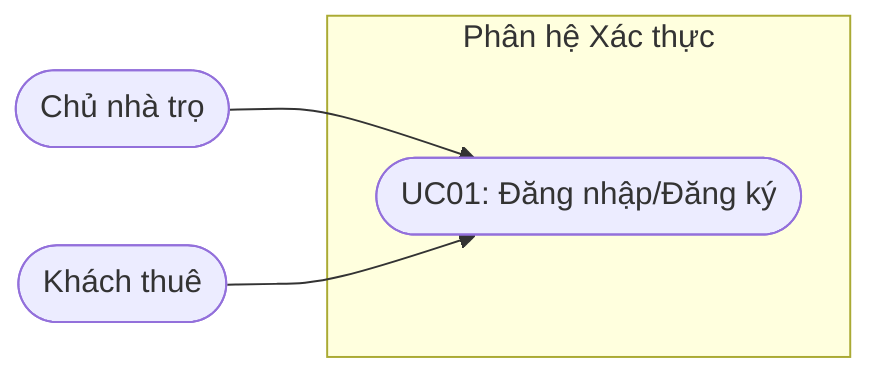
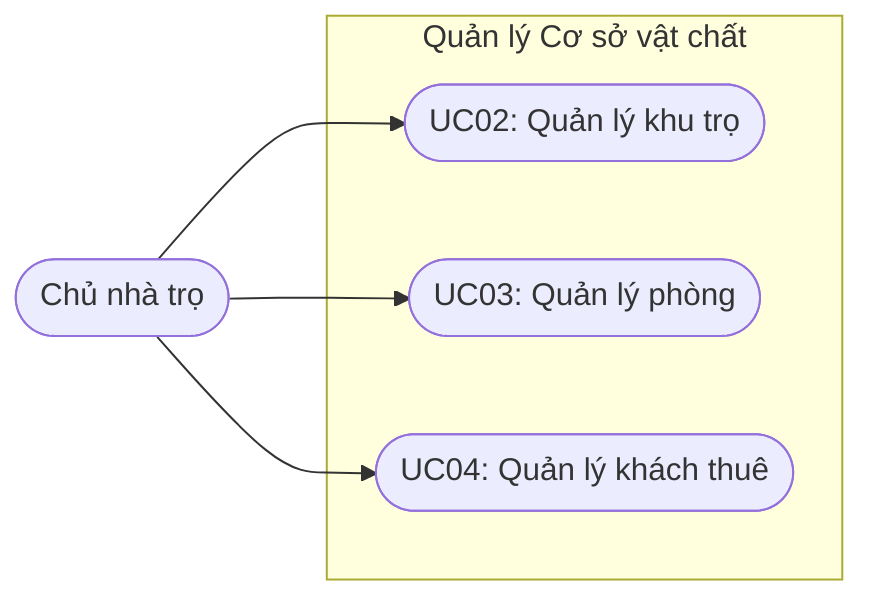
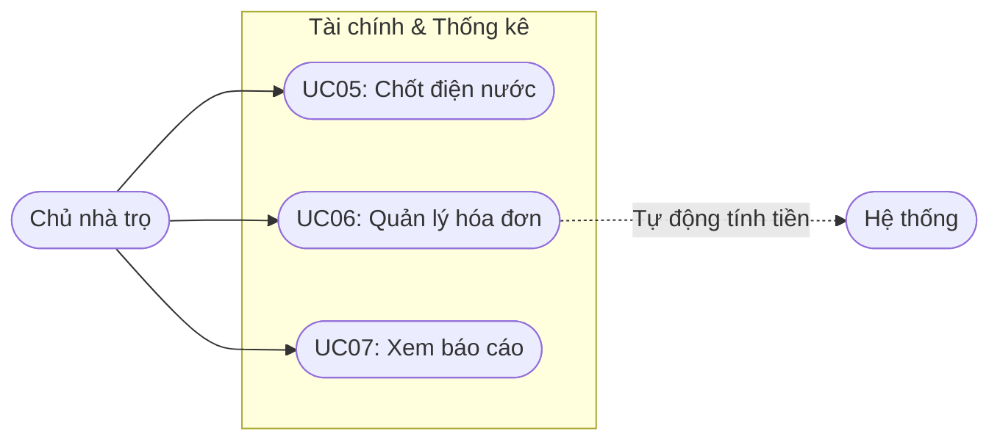
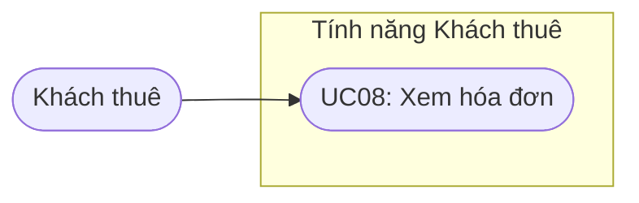
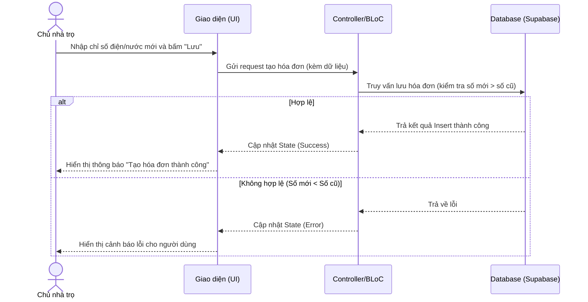
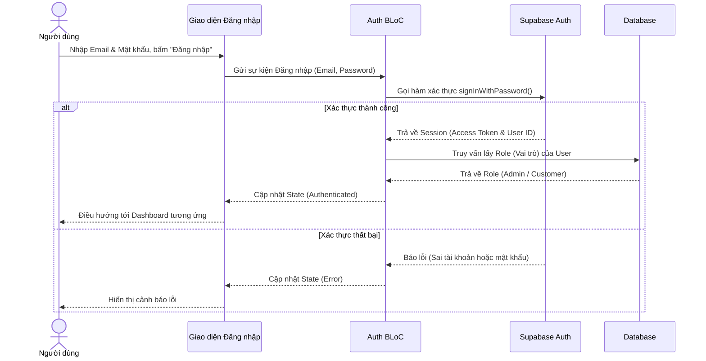
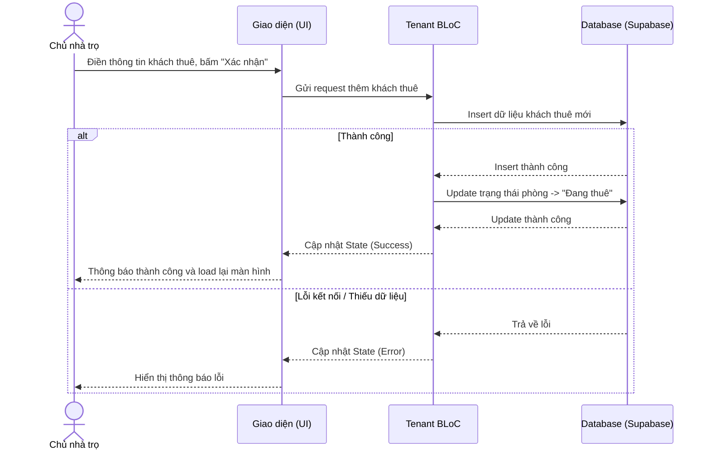
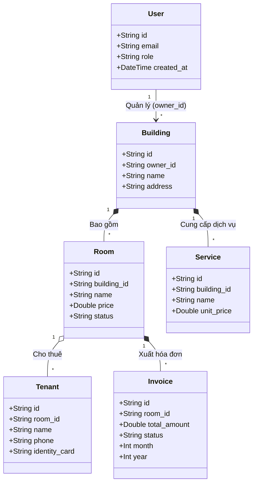

# BÁO CÁO PHÂN TÍCH VÀ THIẾT KẾ HỆ THỐNG

## CHƯƠNG I: MỞ ĐẦU

### 1.1. Tên đề tài
**TroKeeper - Hệ thống Quản lý Nhà trọ Đa nền tảng**

### 1.2. Lý do chọn đề tài
Trong bối cảnh đô thị hóa nhanh chóng, nhu cầu thuê nhà trọ, chung cư mini ngày càng tăng cao. Tuy nhiên, phần lớn các chủ nhà trọ hiện nay vẫn đang sử dụng các phương pháp quản lý thủ công (ghi chép sổ sách, file Excel), dẫn đến nhiều vấn đề tồn đọng:
- **Sai sót trong tính toán:** Việc ghi chỉ số điện nước, tính toán phụ phí thủ công dễ xảy ra nhầm lẫn, dẫn đến tranh chấp với người thuê.
- **Khó khăn trong việc tra cứu:** Thông tin khách thuê, hợp đồng, lịch sử thu chi bị phân tán, mất nhiều thời gian để tìm kiếm.
- **Quản lý trạng thái kém:** Khó nắm bắt chính xác tình trạng phòng (trống, sắp trả, đang nợ tiền) ngay lập tức.
- **Giao tiếp hạn chế:** Thông báo đóng tiền hay các nội quy thường thông qua tin nhắn cá nhân, dễ trôi tin và thiếu tính chuyên nghiệp.

Vì vậy, việc phát triển một phần mềm quản lý nhà trọ tự động, đa nền tảng (Web & Mobile) là vô cùng cấp thiết, giúp tối ưu hóa quy trình, tiết kiệm thời gian và nâng cao hiệu quả kinh doanh.

### 1.3. Kỹ thuật yêu cầu (Requirement Engineering)

#### a) Yêu cầu chức năng
Hệ thống được chia thành 2 phân hệ chính:

**Đối với Chủ nhà trọ (Admin):**
- Đăng ký/Đăng nhập, Quản lý tài khoản cá nhân.
- Quản lý danh sách dãy trọ/khu trọ.
- Quản lý phòng trọ (Thêm, Sửa, Xóa, Cập nhật trạng thái).
- Quản lý khách thuê (Thông tin cá nhân, CCCD, trạng thái lưu trú).
- Quản lý dịch vụ (Giá điện, giá nước, rác, wifi...).
- Lập hóa đơn tự động hàng tháng (Dựa trên chỉ số điện nước cũ - mới).
- Thống kê doanh thu, báo cáo thu chi.

**Đối với Người dùng (Customer / Khách thuê):**
- Đăng nhập (Dành cho tài khoản được Admin cấp).
- Xem thông tin phòng đang thuê, hợp đồng.
- Xem chi tiết hóa đơn hàng tháng và lịch sử thanh toán.
- Xem các thông báo từ chủ nhà trọ.

#### b) Yêu cầu phi chức năng
- **Hiệu năng (Performance):** 
  - Thời gian phản hồi hệ thống (API response time) dưới 2 giây.
  - Hỗ trợ xử lý đồng thời (Concurrent users) ít nhất 1.000 user mà không gián đoạn.
- **An toàn/Khôi phục (Safety):** 
  - Dữ liệu được sao lưu (backup) định kỳ hàng ngày trên Cloud Database (Supabase).
  - Có cơ chế khôi phục dữ liệu khi xảy ra sự cố.
- **Bảo mật & Phân quyền (Confidentiality):** 
  - Mật khẩu phải được mã hóa một chiều (Bcrypt).
  - Áp dụng Row Level Security (RLS), đảm bảo Chủ trọ A không thể xem hay chỉnh sửa dữ liệu nhà trọ của Chủ trọ B.
- **Thuộc tính chất lượng:**
  - **Tính mở rộng (Scalability):** Kiến trúc hệ thống cho phép dễ dàng thêm các tính năng mới trong tương lai (vd: mở rộng thêm các cổng thanh toán khác, tích hợp khóa cửa thông minh IoT).
  - **Dễ bảo trì (Maintainability):** Code áp dụng Clean Architecture, tách biệt rõ UI, Business Logic và Data layer.
  - **Reusability:** Các thành phần giao diện (UI Components) được tái sử dụng tối đa trên cả Web và Mobile.

### 1.4. Quy trình nghiệp vụ (Business Process)
1. **Đăng ký tài khoản:** Chủ nhà trọ (Admin) truy cập hệ thống, đăng ký tài khoản mới qua Email hoặc qua Google.
2. **Thiết lập ban đầu:** Sau khi đăng nhập thành công, chủ trọ tiến hành khởi tạo dữ liệu (Tạo khu trọ mới, danh sách phòng và bảng giá dịch vụ mặc định).
3. **Tiếp nhận khách:** Khách hàng đến xem phòng -> Nếu đồng ý thuê, Chủ trọ nhập thông tin cá nhân của khách vào hệ thống.
4. **Lập hợp đồng & Bàn giao:** Chủ trọ chọn phòng, tạo hợp đồng (nhập ngày bắt đầu, giá tiền cọc, giá dịch vụ) -> Ghi nhận chỉ số điện nước ban đầu -> Đổi trạng thái phòng sang "Đang thuê".
5. **Chốt số điện nước:** Cuối tháng, Chủ trọ đi xem đồng hồ và nhập chỉ số điện, nước mới vào hệ thống.
6. **Tạo hóa đơn:** Hệ thống tự động tính toán (Số mới - Số cũ) * Đơn giá + Tiền phòng + Phụ phí -> Sinh ra hóa đơn.
7. **Thanh toán:** Khách thuê quét mã QR PayOS trên hóa đơn để thanh toán -> Hệ thống nhận Webhook từ PayOS -> Hóa đơn tự động chuyển trạng thái "Đã thanh toán" (Chủ trọ vẫn có thể xác nhận thủ công nếu khách trả tiền mặt).
8. **Kết thúc:** Khách báo trả phòng -> Chủ trọ tất toán hóa đơn cuối, trừ tiền cọc (nếu có) -> Cập nhật trạng thái phòng thành "Trống".

### 1.5. Khảo sát thực tế (Fact Survey)

**Kịch bản phỏng vấn khảo sát**
- **Người phỏng vấn:** Nguyễn Văn A (Phân tích viên)
- **Người được phỏng vấn:** Cô Lan (Chủ dãy trọ 30 phòng tại Quận 9)
- **Vai trò:** Lấy yêu cầu thực tế từ end-user.

| STT | Câu hỏi khảo sát (Phân tích viên) | Câu trả lời (Chủ trọ) |
|-----|-----------------------------------|-----------------------|
| 1 | Cô hiện đang quản lý thông tin khách thuê và tính tiền điện nước hàng tháng bằng cách nào? | Cô chủ yếu ghi vào cuốn sổ lớn. Cuối tháng cầm sổ đi từng phòng chốt số điện, sau đó về lấy máy tính bấm rồi ghi ra giấy nhét vào khe cửa từng phòng. |
| 2 | Trong quá trình đó, cô có thường gặp khó khăn hay sai sót gì không? | Thỉnh thoảng cô nhìn nhầm số điện hoặc bấm máy tính nhầm, sinh viên kiến nghị lại phải tính lại từ đầu. Với lại nhiều khi sổ bị thất lạc hoặc ướt, mất hết dữ liệu tháng trước. |
| 3 | Việc theo dõi phòng nào đóng tiền, phòng nào chưa diễn ra như thế nào ạ? | Cô phải dò từng dòng trong sổ, phòng nào đóng rồi thì lấy bút đỏ gạch đi. Đôi khi bận quá cô cũng quên mất ai đóng rồi, ai chưa. |
| 4 | Nếu có một ứng dụng trên điện thoại giúp cô nhập số điện nước và tự động tính ra tổng tiền, lưu trữ mọi thứ, cô thấy sao? | Vậy thì tiện quá! Cô chỉ cần cầm điện thoại bấm bấm là xong. Nhưng ứng dụng phải dễ dùng nhé, chữ to rõ ràng vì cô có tuổi rồi. |

---

## CHƯƠNG II: MÔ TẢ CHI TIẾT

### 2.1. Đặc tả hệ thống
Hệ thống **TroKeeper** là phần mềm quản lý nhà trọ khép kín, tập trung giải quyết bài toán quản trị luồng tiền và lưu trú. 
- **Phân hệ Admin:** Cung cấp đầy đủ công cụ CRUD (Create, Read, Update, Delete) cho Phòng, Khách thuê, Dịch vụ và Hóa đơn. Được thiết kế tối ưu trên Web (màn hình lớn để xem báo cáo) và Mobile (để tiện cầm đi chốt điện nước).
- **Phân hệ Khách hàng:** Giao diện đơn giản (Mobile App/Web Mobile), tập trung hiển thị thông tin hóa đơn hiện tại, lịch sử thanh toán và thông tin phòng đang thuê để theo dõi minh bạch.

### 2.2. Đối tượng mục tiêu & Phạm vi dự án
- **Đối tượng mục tiêu:** Cá nhân, hộ gia đình hoặc tổ chức đang kinh doanh mô hình nhà trọ, chung cư mini, phòng trọ dịch vụ có quy mô từ 10 đến 200 phòng.
- **Phạm vi dự án:** 
  - Không gian: Triển khai trên môi trường Internet (Cloud).
  - Tính năng: Hệ thống cung cấp đầy đủ nghiệp vụ quản lý (phòng, khách thuê, hóa đơn) và đặc biệt đã tích hợp thanh toán tự động qua PayOS (sinh mã QR động, tự động gạch nợ).
  - Giới hạn: Trong giai đoạn 1, hệ thống chưa bao gồm tính năng tích hợp khóa thông minh (IoT Smart Lock).

### 2.3. Tính khả thi
- **Tính khả thi Kỹ thuật:** Các công nghệ lựa chọn (Flutter, Supabase) đều là các framework/platform hiện đại, tài liệu đầy đủ, cộng đồng hỗ trợ lớn. Đội ngũ phát triển đã nắm vững kiến trúc ứng dụng.
- **Tính khả thi Tài chính:** Chi phí hạ tầng trong thời gian đầu sử dụng gói Free Tier của Supabase và Vercel, giúp tối ưu chi phí khởi tạo. Sau khi có doanh thu có thể dễ dàng scale up lên các gói trả phí.

### 2.4. Bảng Tác nhân (Actors)

| Tên Tác nhân | Mô tả vai trò |
|--------------|---------------|
| **Khách thuê (Customer)** | Người đang thuê phòng. Sử dụng hệ thống để xem thông báo, xem chi tiết hóa đơn tiền phòng hàng tháng. |
| **Chủ nhà trọ (Admin)** | Người có toàn quyền quản trị nhà trọ của mình. Quản lý dữ liệu phòng, lập hóa đơn, quản lý khách thuê. |
| **Hệ thống (System)** | Tác nhân tự động thực hiện các tác vụ ngầm như tính toán tổng tiền, thống kê doanh thu, gửi thông báo. |

### 2.5. Bảng Danh sách Use Case & Bảng Chức năng hệ thống

| Mã UC | Tên Use Case | Mô tả ngắn gọn |
|-------|--------------|----------------|
| UC01 | Đăng nhập/Đăng ký | Xác thực người dùng truy cập vào hệ thống. |
| UC02 | Quản lý khu trọ | Thêm, sửa, xóa các khu nhà trọ khác nhau. |
| UC03 | Quản lý phòng | Cấu hình giá phòng, trạng thái, diện tích phòng. |
| UC04 | Quản lý khách thuê | Lưu thông tin cá nhân, CCCD, ngày bắt đầu thuê. |
| UC05 | Chốt điện nước | Cập nhật chỉ số đồng hồ điện nước cuối tháng. |
| UC06 | Quản lý hóa đơn | Sinh hóa đơn, cập nhật trạng thái thanh toán. |
| UC07 | Xem báo cáo | Thống kê doanh thu, phòng trống. |
| UC08 | Xem hóa đơn (Khách) | Khách thuê xem chi tiết khoản phải trả. |

---

## CHƯƠNG III: THIẾT KẾ CHI TIẾT

### 3.1. Sơ đồ Use Case & Đặc tả Use Case

Để mô hình trực quan và tránh rối mắt khi hiển thị quá nhiều thông tin, Sơ đồ Use Case được chia nhỏ theo từng nhóm chức năng:

#### a) Nhóm chức năng Xác thực

#### b) Nhóm chức năng Quản lý Nhà trọ & Khách thuê

#### c) Nhóm chức năng Tài chính & Báo cáo

#### d) Nhóm chức năng dành cho Khách thuê

**Đặc tả Use Case nổi bật: UC06 - Quản lý hóa đơn (Lập hóa đơn mới)**
- **Tên Use Case:** Lập hóa đơn hàng tháng.
- **Actor:** Chủ nhà trọ (Admin).
- **Pre-conditions (Tiền điều kiện):** Admin đã đăng nhập; Phòng đã có khách thuê; Đã thiết lập giá dịch vụ.
- **Post-conditions (Hậu điều kiện):** Một hóa đơn mới được tạo ra trong CSDL, trạng thái là "Chưa thanh toán".
- **Luồng sự kiện chính (Basic Flow):**
  1. Admin chọn chức năng "Lập hóa đơn".
  2. Hệ thống hiển thị danh sách các phòng đang thuê.
  3. Admin chọn một phòng, hệ thống tự động tải chỉ số điện/nước tháng trước.
  4. Admin nhập chỉ số điện/nước tháng này.
  5. Hệ thống tính toán và hiển thị bản preview tổng tiền.
  6. Admin nhấn "Tạo hóa đơn".
  7. Hệ thống lưu hóa đơn và thông báo thành công.
- **Luồng ngoại lệ (Exception Flow):**
  - Bước 4: Admin nhập chỉ số mới nhỏ hơn chỉ số cũ -> Hệ thống báo lỗi, yêu cầu nhập lại.

**Đặc tả Use Case: UC01 - Đăng nhập/Đăng ký**
- **Tên Use Case:** Đăng nhập và Đăng ký tài khoản.
- **Actor:** Chủ nhà trọ (Admin), Khách thuê (Customer).
- **Pre-conditions (Tiền điều kiện):** Người dùng có thiết bị kết nối Internet.
- **Post-conditions (Hậu điều kiện):** Người dùng được xác thực và chuyển hướng vào màn hình chính tương ứng với vai trò (Role).
- **Luồng sự kiện chính (Basic Flow):**
  1. Người dùng mở ứng dụng và chọn "Đăng nhập".
  2. Người dùng nhập Email và Mật khẩu, hoặc chọn "Đăng nhập bằng Google".
  3. Hệ thống gửi yêu cầu xác thực tới Database (Supabase Auth).
  4. Xác thực thành công, trả về Access Token.
  5. Hệ thống kiểm tra vai trò (Admin/Customer) và điều hướng vào Dashboard (Admin) hoặc Trang chủ Khách thuê (Customer).
- **Luồng ngoại lệ (Exception Flow):**
  - Bước 3: Sai tài khoản/mật khẩu -> Hệ thống hiển thị thông báo lỗi "Tài khoản hoặc mật khẩu không chính xác".

**Đặc tả Use Case: UC03 - Quản lý phòng (Thêm phòng mới)**
- **Tên Use Case:** Thêm phòng trọ mới vào khu trọ.
- **Actor:** Chủ nhà trọ (Admin).
- **Pre-conditions (Tiền điều kiện):** Admin đã đăng nhập; Đã có ít nhất một Khu trọ được tạo.
- **Post-conditions (Hậu điều kiện):** Một phòng mới được tạo trong CSDL, trạng thái mặc định là "Trống".
- **Luồng sự kiện chính (Basic Flow):**
  1. Admin vào màn hình "Quản lý phòng", chọn chức năng "Thêm phòng mới".
  2. Hệ thống hiển thị form nhập liệu bao gồm: Tên phòng, Giá thuê, Chọn Khu trọ.
  3. Admin điền đầy đủ thông tin hợp lệ và nhấn "Lưu".
  4. Hệ thống kiểm tra dữ liệu đầu vào.
  5. Dữ liệu được lưu xuống CSDL. Hệ thống hiển thị thông báo "Thêm phòng thành công" và cập nhật danh sách phòng.
- **Luồng ngoại lệ (Exception Flow):**
  - Bước 4: Admin bỏ trống Tên phòng hoặc Giá thuê <= 0 -> Hệ thống hiển thị thông báo "Vui lòng nhập đầy đủ và hợp lệ các thông tin bắt buộc".

**Đặc tả Use Case: UC04 - Quản lý khách thuê (Thêm khách thuê mới)**
- **Tên Use Case:** Thêm thông tin khách thuê vào phòng.
- **Actor:** Chủ nhà trọ (Admin).
- **Pre-conditions (Tiền điều kiện):** Admin đã đăng nhập; Có ít nhất một phòng đang ở trạng thái "Trống".
- **Post-conditions (Hậu điều kiện):** Thông tin khách thuê được lưu vào hệ thống, phòng chuyển sang trạng thái "Đang thuê".
- **Luồng sự kiện chính (Basic Flow):**
  1. Admin chọn một phòng đang trống và nhấn "Thêm khách thuê".
  2. Hệ thống hiển thị form nhập thông tin: Họ tên, Số điện thoại, CCCD, Ngày bắt đầu thuê, Tiền cọc.
  3. Admin điền thông tin và nhấn "Xác nhận".
  4. Hệ thống kiểm tra tính hợp lệ của dữ liệu đầu vào.
  5. Hệ thống lưu khách thuê mới, cập nhật trạng thái phòng thành "Đang thuê" và hiển thị thông báo thành công.
- **Luồng ngoại lệ (Exception Flow):**
  - Bước 4: Admin bỏ trống Họ tên hoặc Số điện thoại -> Hệ thống báo lỗi "Vui lòng nhập các thông tin bắt buộc".
  - Bước 4: Số điện thoại không đúng định dạng -> Hệ thống báo "Số điện thoại không hợp lệ".

### 3.2. Sơ đồ Hoạt động (Activity Diagram) & Sơ đồ Tuần tự (Sequence Diagram)

**Sơ đồ Tuần tự (Lập hóa đơn):**

**Sơ đồ Tuần tự (Đăng nhập hệ thống):**

**Sơ đồ Tuần tự (Thêm khách thuê):**

### 3.3. Sơ đồ Lớp (Class Diagram)
Dưới đây là sơ đồ mô tả các lớp thực thể (Entity Classes) chính trong hệ thống, bao gồm các thuộc tính và mối quan hệ (Associations) giữa chúng:

### 3.4. Mô hình Dữ liệu Quan hệ (Relational Data Model) & Sơ đồ ERD

**Cấu trúc các Bảng chính (Tables):**

**1. Bảng `users` (Tài khoản người dùng)**
- `iduser` (UUID) - **PK**: Khóa chính (Liên kết với Supabase Auth).
- `tenuser`, `email`, `sdt`: Thông tin cá nhân cơ bản.
- `quyenhan`: Vai trò (admin / khách thuê).

**2. Bảng `nhatro` (Khu trọ / Tòa nhà)**
- `id` (UUID) - **PK**: Khóa chính.
- `iduser` (UUID) - **FK**: Tham chiếu `users.iduser` (Chủ trọ quản lý khu này).
- `name`, `address`: Tên và địa chỉ khu trọ.

**3. Bảng `phong` (Phòng trọ)**
- `id` (UUID) - **PK**: Khóa chính.
- `property_id` (UUID) - **FK**: Tham chiếu `nhatro.id`.
- `room_number`: Tên hoặc số phòng.
- `rent_price`, `electric_price`, `water_price`, `service_price`: Đơn giá cấu hình cho phòng.
- `status`: Trạng thái phòng (EMPTY, OCCUPIED, MAINTENANCE).

**4. Bảng `khachthue` (Khách thuê)**
- `id` (UUID) - **PK**: Khóa chính.
- `room_id` (UUID) - **FK**: Tham chiếu `phong.id`.
- `user_id` (UUID) - **FK**: Tham chiếu `users.iduser` (Tài khoản đăng nhập của khách nếu có).
- `full_name`, `phone_number`, `cccd_number`: Thông tin định danh của khách.

**5. Bảng `hoadon` (Hóa đơn tổng)**
- `id` (UUID) - **PK**: Khóa chính.
- `room_id` (UUID) - **FK**: Tham chiếu `phong.id`.
- `tenant_id` (UUID) - **FK**: Tham chiếu `khachthue.id`.
- `month`, `year`: Kỳ hóa đơn (Tháng / Năm).
- `total_amount`: Tổng số tiền khách cần thanh toán.
- `status`: Trạng thái (PENDING, PAID, OVERDUE, ...).

**6. Bảng `chitiethoadon` (Chi tiết từng khoản của hóa đơn)**
- `id` (UUID) - **PK**: Khóa chính.
- `invoice_id` (UUID) - **FK**: Tham chiếu `hoadon.id` (Ràng buộc UNIQUE, quan hệ 1-1).
- `electric_curr_reading`, `water_curr_reading`: Chỉ số điện, nước chốt cuối tháng.
- `rent_amount`, `service_amount`: Các khoản chi phí chi tiết.

---

## CHƯƠNG IV: QUY TRÌNH THỰC TẾ

### 4.1. Mô hình vòng đời phát triển phần mềm
Dự án áp dụng **Mô hình Waterfall (Thác nước)** kết hợp linh hoạt.
- **Khái niệm & Giai đoạn:** Bao gồm các bước: Khảo sát/Phân tích yêu cầu $\rightarrow$ Thiết kế hệ thống $\rightarrow$ Lập trình (Implementation) $\rightarrow$ Kiểm thử (Testing) $\rightarrow$ Triển khai & Bảo trì (Deployment).
- **Ưu điểm:** Quy trình rõ ràng, tài liệu đầy đủ ở từng khâu, giúp các thành viên nhóm dễ dàng bám sát tiến độ.
- **Nhược điểm:** Kém linh hoạt khi có sự thay đổi yêu cầu đột ngột từ người dùng.
- **Lý do chọn lựa:** Phù hợp với đồ án học thuật/dự án nhỏ có thời gian xác định, yêu cầu nghiệp vụ quản lý nhà trọ mang tính chuẩn mực, ít thay đổi lớn.

### 4.2. Kiến trúc & Công nghệ sử dụng

| Tên Công nghệ / Framework | Vai trò / Lý do sử dụng |
|---------------------------|-------------------------|
| **Flutter (Dart)** | Xây dựng UI đa nền tảng (Web, Android, iOS) từ một source code. Tốc độ phát triển nhanh. |
| **BLoC Pattern** | Quản lý trạng thái (State Management) mạnh mẽ, giúp tách biệt Logic và UI. |
| **Supabase (PostgreSQL)** | Cung cấp Backend-as-a-Service, Database SQL, Authentication và Storage lưu ảnh nhanh chóng. |
| **Vercel** | Triển khai (Hosting) phiên bản Web App nhanh, hỗ trợ CI/CD. |
| **Clean Architecture** | Kiến trúc chia thành Presentation, Domain, Data layers giúp code dễ test, dễ mở rộng. |

---

## CHƯƠNG V: GIAO DIỆN & CODE DEMO

Danh sách các màn hình chính đã xây dựng:

**Phía Admin (Chủ nhà trọ):**
1. **Màn hình Đăng nhập / Đăng ký:** Form xác thực bằng Email/Password.
2. **Dashboard Thống kê:** Hiển thị biểu đồ doanh thu, số phòng trống, số tiền đang nợ.
3. **Quản lý Phòng:** Danh sách dạng Grid/List view các phòng, hiển thị màu sắc theo trạng thái (Xanh = Đang thuê, Trắng = Trống, Đỏ = Nợ tiền).
4. **Chi tiết Phòng:** Hiển thị thông tin khách đang thuê, các chỉ số điện nước tháng trước.
5. **Lập Hóa Đơn:** Form nhập chỉ số điện nước mới, tự động tính tổng tiền.
6. **Lịch sử Thu chi:** Danh sách các hóa đơn đã xuất.

**Phía Customer (Khách thuê):**
1. **Màn hình Đăng nhập (Khách):** Đăng nhập bằng số điện thoại/Mã code.
2. **Trang chủ Khách thuê:** Hiển thị số tiền cần đóng tháng này, hạn chót thanh toán.
3. **Lịch sử thanh toán:** Danh sách các tháng đã đóng tiền.
4. **Chi tiết hợp đồng:** Xem lại các thỏa thuận giá cả ban đầu.

---

## CHƯƠNG VI: KIỂM THỬ PHẦN MỀM (TEST CASE & UNIT TEST)

**Bảng Kiểm thử mẫu (Manual Test Cases)**

| ID | Nội dung Test Case | Dữ liệu đầu vào (Inputs) | Kết quả mong đợi (Expected) | Trạng thái |
|----|--------------------|--------------------------|-----------------------------|------------|
| TC01 | Đăng nhập đúng thông tin | Email: `admin@abc.com`, Pass: `123456` | Đăng nhập thành công, chuyển tới Dashboard | Pass |
| TC02 | Đăng nhập sai mật khẩu | Email: `admin@abc.com`, Pass: `sai_pass` | Thông báo "Tài khoản hoặc mật khẩu không đúng" | Pass |
| TC03 | Thêm phòng thiếu thông tin | Tên phòng: (Trống), Giá: `2000000` | Báo lỗi ở UI "Vui lòng nhập tên phòng" | Pass |
| TC04 | Lập hóa đơn (Chỉ số hợp lệ) | Điện cũ: 100, Điện mới: 150 | Tính đúng = (150-100)*Giá điện + Tiền phòng | Pass |
| TC05 | Lập hóa đơn (Chỉ số lỗi) | Điện cũ: 100, Điện mới: 90 | Báo lỗi "Chỉ số mới không được nhỏ hơn chỉ số cũ" | Pass |
| TC06 | Cập nhật phòng khi trả | Đang thuê -> Đổi sang "Trống" | Xóa khách khỏi phòng, lưu vào lịch sử, phòng chuyển trắng | Pass |
| TC07 | RLS Security | Chủ trọ A gọi API lấy Invoices Chủ trọ B | Database từ chối trả kết quả (Mảng rỗng) | Pass |

---

## TÀI LIỆU THAM KHẢO

1. **Tài liệu Flutter chính thức:** Hướng dẫn xây dựng giao diện và quản lý state. (Link: [https://flutter.dev/docs](https://flutter.dev/docs))
2. **Tài liệu BLoC Library:** Kiến trúc quản lý trạng thái. (Link: [https://bloclibrary.dev](https://bloclibrary.dev))
3. **Tài liệu Supabase:** Cấu hình Authentication và Row Level Security (RLS) cho PostgreSQL. (Link: [https://supabase.com/docs](https://supabase.com/docs))
4. **Sách:** *Clean Architecture: A Craftsman's Guide to Software Structure and Design* - Robert C. Martin (Uncle Bob).
5. **Sách:** *Software Engineering (10th Edition)* - Ian Sommerville.
